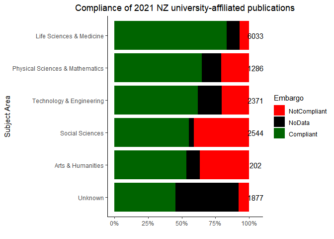

# MBIE Compliance
Tom Saunders

Read in CONZUL data and a list of subject categories used by Web of
Science.

``` r
df <- read_csv("data_raw/conzul-data-raw.csv")
wos <- read_csv("data_raw/wos-subjects.csv")
```

Select & rename columns, filter to outputs published in 2021.

``` r
df <- df %>% 
  select(doi = 1, 
         status = 4, 
         journal = 14, 
         year = 15,
         publisher = 16,
         oa = 17,
         genre = 18, 
         embargo = 29, 
         crossref = 34, 
         subject = 52, 
         rutherford = 55,
         marsden = 56,
         royalsoc = 57,
         mbie = 58,
         hrc = 59) %>% 
  filter(year == "2021")
```

Merge ‘subjects’ into higher-level categories.

``` r
df$subject <- gsub(";.*","",df$subject)

colnames(wos) <- c("Arts & Humanities", "Life Sciences & Medicine", 
                   "Physical Sciences & Mathematics", 
                   "Social Sciences", "Technology & Engineering")
```

Rename subject factors to categories used by Web of Science.

``` r
new_ids <- map(wos, ~ .x[!is.na(.x)])

df$subject <- fct_collapse(df$subject, !!!new_ids)

df$subject <- recode(df$subject, 
                     `Arts & Humanities - Other Topics` = 'Arts & Humanities', 
                     `Life Sciences & Biomedicine - Other Topics` = 'Life Sciences & Medicine',
                     `Science & Technology - Other Topics` = 'Technology & Engineering',
                     `Social Sciences - Other Topics` = 'Social Sciences')

df$subject <- fct_explicit_na(df$subject, "Unknown")
```

Rename categories within the ‘embargo’ column.

``` r
df$embargo <- fct_explicit_na(df$embargo, "NoData")

df$embargo <- fct_collapse(df$embargo, 
                           NotCompliant = c("18 months", "24 months", "2y", "36 months"),
                           Compliant = c("None", "6 months", "3 months", "12 months"))

df$embargo <- factor(df$embargo, levels = c('NotCompliant', 'NoData', 'Compliant'))

df <- within(df, embargo[embargo == 'NoData' & status == "gold"] <- 'Compliant')
df <- within(df, embargo[embargo == 'NoData' & status == "diamond"] <- 'Compliant')
```

Summarise and get totals.

``` r
df2 <- df %>% 
  group_by(subject) %>%
  count(embargo) %>% 
  mutate(
    pct = n / sum(n) * 100,
  )

totals <- df %>% 
  group_by(subject) %>% 
  summarise(
    total = n(),
  )
```

Plot compliance by discipline.

``` r
ggplot(df2, aes(x = subject, y = pct, fill = embargo)) +
  geom_bar(position = "fill", stat = "identity") +
  coord_flip() +
  theme_classic() +
  scale_fill_manual(values=c("red", "black","darkgreen")) +
  scale_y_continuous(labels = scales::percent) +
  ggtitle("Compliance of 2021 NZ university-affiliated publications") +
  xlab("Subject Area") +
  ylab("") +
  labs(fill = "Embargo") +
  scale_x_discrete(limits = c("Unknown", "Arts & Humanities",
                              "Social Sciences", "Technology & Engineering",  
                              "Physical Sciences & Mathematics", 
                              "Life Sciences & Medicine")) +
  geom_text(aes(subject, 1.05, label = total, fill = NULL), data = totals) +
  theme(plot.title = element_text(hjust = 0.5))
```


